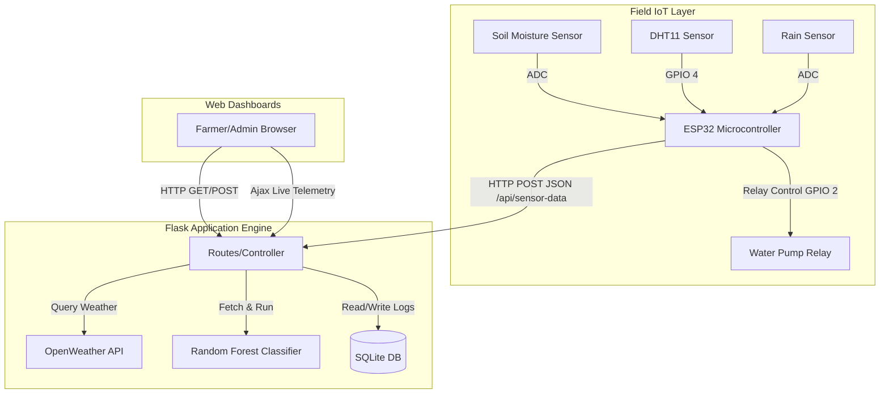
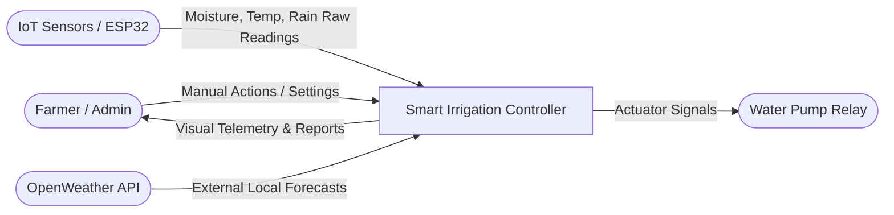
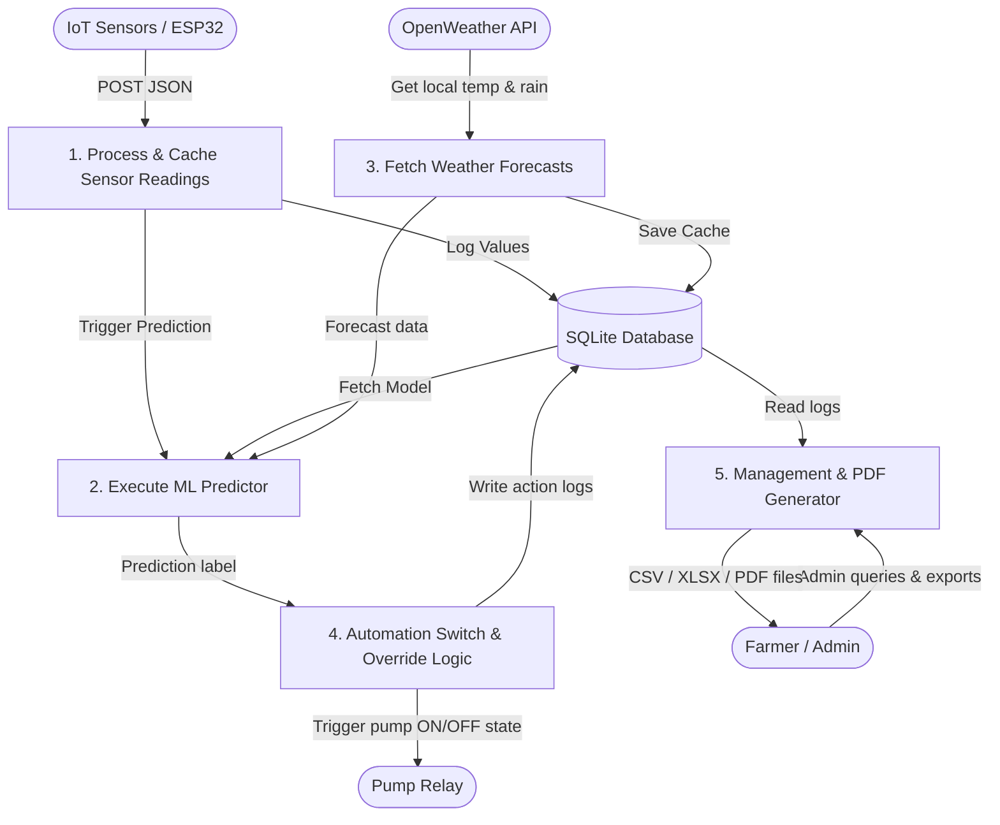
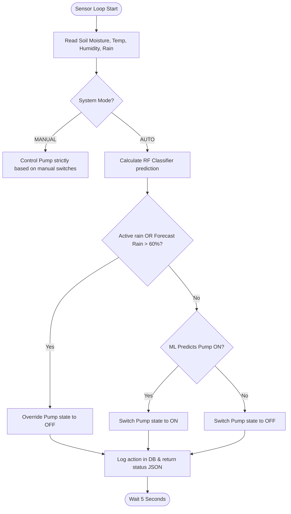
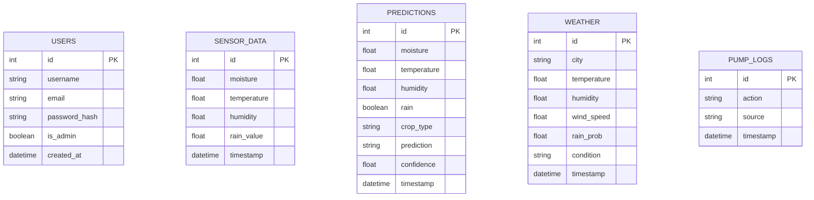
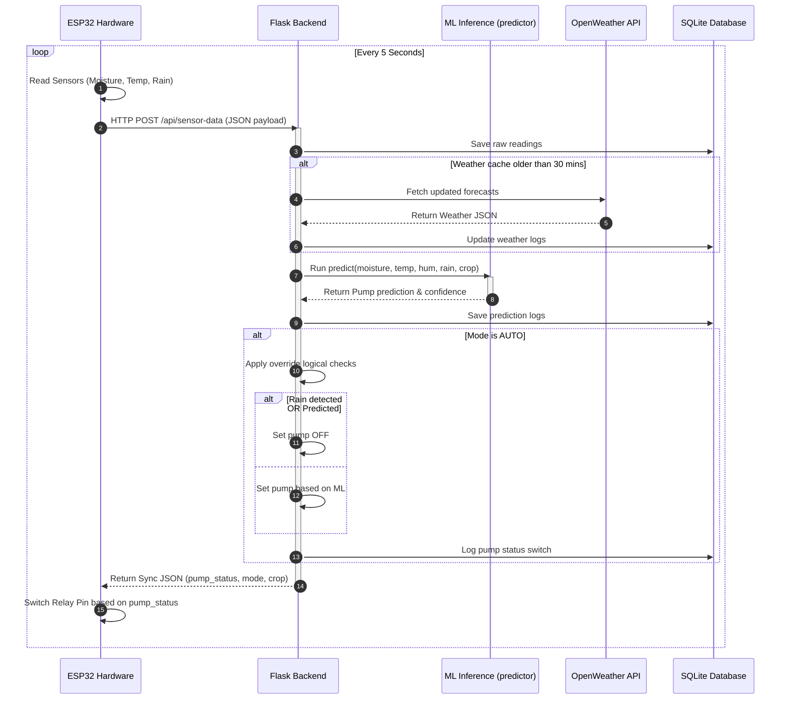
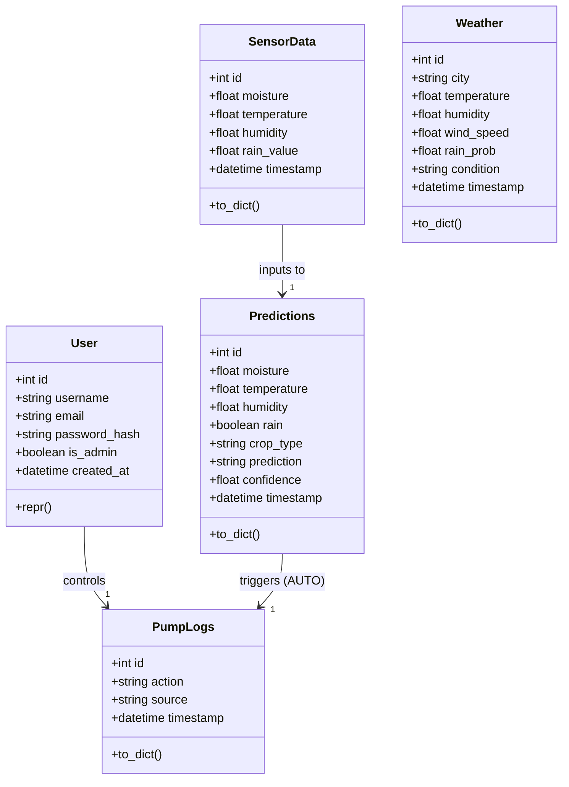

# Smart Irrigation System Using IoT and Machine Learning

A complete, production-ready Final Year Engineering Project designed to reduce water wastage in agriculture. This system integrates real-time IoT sensors (ESP32) and Machine Learning (Random Forest Classifier) to automate crop irrigation, providing farmers with a modern, responsive web dashboard (Bootstrap 5 & glassmorphism) with built-in dark mode, live charts, reporting exports, and full authentication.

---

## 🚀 Key Features

*   **Dual Operating Modes:**
    *   **AI Auto Mode:** Automated pump decisions utilizing a Random Forest Classifier trained on crop thresholds and weather factors.
    *   **Manual Mode:** Instant manual pump control (ON/OFF) overrides.
*   **Weather API Integration:** Pulls forecast data from OpenWeather API. Lockout safety locks the pump OFF if heavy rain is predicted.
*   **Sensor Simulation Mode:** Automatically generates varying sensor readings if hardware is offline, keeping the dashboard 100% functional.
*   **Analytics & Reporting:** Live line charts (Chart.js) and admin export options for PDF, CSV, and Excel (openpyxl).
*   **Premium Glassmorphic UI:** Agricultural theme styling (sage & forest green), sidebar, dynamic tables, and Dark Mode.
*   **Authentication:** Multi-role access (Admin and Farmer roles) with sign-up, sign-in, and password reset capability.

---

## 📁 Folder Structure

```
Smart-Irrigation/
├── app.py                  # Flask Application Core
├── config.py               # Global Configurations & Thresholds
├── requirements.txt        # Package dependencies
├── README.md               # Project Documentation
├── dataset/
│   └── crop_data.csv       # 5000 generated training rows
├── model/
│   └── model.pkl           # Trained Random Forest Model
├── database/
│   └── models.py           # SQLite Database Models
├── templates/
│   ├── layout.html         # Base Glassmorphism layout
│   ├── login.html          # Authentication / Reset Form
│   ├── signup.html         # User Registration
│   ├── dashboard.html      # Sensor monitoring & switches
│   ├── admin.html          # User logs & download tables
│   └── charts.html         # Analytical graphs & history
├── static/
│   ├── css/
│   │   └── style.css       # Core stylesheets & theme modes
│   ├── js/
│   │   └── main.js         # Sidebar and light/dark theme toggles
│   └── images/
│       └── agriculture_bg.jpg # Background illustration
├── iot/
│   └── esp32_code/
│       └── esp32.ino       # ESP32 Arduino IDE Sketch
├── ml/
│   ├── train_model.py      # Random Forest Dataset Generator & Trainer
│   └── predict.py          # Machine learning inference handler
├── routes.py               # API & Page Routing controllers
├── utils.py                # Simulated values, CSV/XLSX/PDF Exporters
└── weather.py              # OpenWeather API Call & Fallbacks
```

---

## 🛠️ Installation & Setup

### Prerequisites
1. Install **Python 3.8+** on your computer.
2. Install **VS Code** with Python extension enabled.

### Backend Setup
1. Clone or copy the `Smart-Irrigation` project folder onto your desktop.
2. Open the folder in VS Code.
3. Open a terminal (`Ctrl + ~`) in VS Code and run:
   ```bash
   pip install -r requirements.txt
   ```
4. Run the application:
   ```bash
   python app.py
   ```
5. Open your browser and navigate to `http://localhost:5000`.
   *   **Default Admin credentials:** `admin` / `admin123`
   *   **Default Farmer credentials:** `farmer` / `farmer123`

### OpenWeather Integration (Optional)
To query live weather conditions instead of using simulated data:
1. Obtain a free API key from [OpenWeatherMap](https://openweathermap.org/).
2. Edit `config.py` and replace `OPENWEATHER_API_KEY` or export the environment variable:
   ```bash
   $env:OPENWEATHER_API_KEY="your_api_key"
   ```

---

## 🔌 IoT Hardware Connections (ESP32)

| ESP32 Pin | Component Pin | Description |
| :--- | :--- | :--- |
| **GPIO 34 (ADC1)** | A0 - Soil Moisture | Measures Soil Volumetric Water Content |
| **GPIO 35 (ADC1)** | A0 - Rain Sensor | Detects Active Precipitation |
| **GPIO 4** | Data - DHT11 | Measures Temperature & Relative Humidity |
| **GPIO 2** | Signal - 5V Relay | Switches high-voltage Water Pump ON/OFF |
| **GPIO 15** | Anode - Status LED | Blinks when posting HTTP payload |
| **3V3 & GND** | VCC & GND | Common power bus |

---

## 🧠 Machine Learning Details

The system automatically initializes and trains a **Random Forest Classifier** using a generated dataset of 5,000 realistic crop health logs (`crop_data.csv`).

### Features:
1.  **Soil Moisture (%)**
2.  **Temperature (°C)**
3.  **Humidity (%)**
4.  **Rain (0/1)**
5.  **Crop Type (Encoded)**

### Target Labels:
*   `0`: Pump OFF
*   `1`: Pump ON

### Baseline Threshold Rules (Used to synthesize dataset prior to training):
*   **Rice:** High moisture requirement (Pump ON if moisture < 60% & Rain is 0).
*   **Wheat:** Low moisture requirement (Pump ON if moisture < 40% & Rain is 0).
*   **Maize:** Medium moisture requirement (Pump ON if moisture < 45% & Rain is 0).
*   **Cotton:** Dry soil crop (Pump ON if moisture < 35% & Rain is 0).
*   **Sugarcane:** Medium-high moisture requirement (Pump ON if moisture < 50% & Rain is 0).
*   *Note: 5% noise is introduced into the dataset to verify that the classifier learns generalizable probability boundaries instead of strict, rigid rules.*

---

## 📊 System Diagrams & Design Documentation

The following diagrams illustrate the architecture, flow, and structural layout of the system.

### 1. System Architecture


### 2. DFD Level 0 (Context Diagram)


### 3. DFD Level 1 (Process Breakdown)


### 4. Data Flowchart (Automation Algorithm)


### 5. Entity Relationship (ER) Diagram


### 6. Use Case Diagram
```mermaid
leftToRightDirection
actor Farmer as "Farmer / User"
actor Admin as "System Administrator"

rectangle System {
    usecase UC1 as "Register / Log In"
    usecase UC2 as "Monitor Live Telemetry"
    usecase UC3 as "Override Pump Manually"
    usecase UC4 as "Change Crop Profile"
    usecase UC5 as "Manage User Accounts"
    usecase UC6 as "Review ML logs"
    usecase UC7 as "Export Reports (PDF/Excel)"
}

Farmer --> UC1
Farmer --> UC2
Farmer --> UC3
Farmer --> UC4

Admin --> UC1
Admin --> UC2
Admin --> UC5
Admin --> UC6
Admin --> UC7
```

### 7. Sequence Diagram (ESP32 Post & Actuation Loop)


### 8. Class Diagram


---

## 🔮 Future Scope

1.  **Nutrient Sensing (NPK):** Adding NPK sensor support to suggest fertilizer application dynamically using supplementary classification models.
2.  **Solar-Powered System:** Designing solar harvesting circuits to make the field module fully off-grid.
3.  **Mobile Application:** Packaging the API responses inside a Flutter or React Native mobile app for Android/iOS.
4.  **Multi-Zone Irrigation:** Extending routing solenoid valves to independently control irrigation on multiple crop zones using one ESP32.
